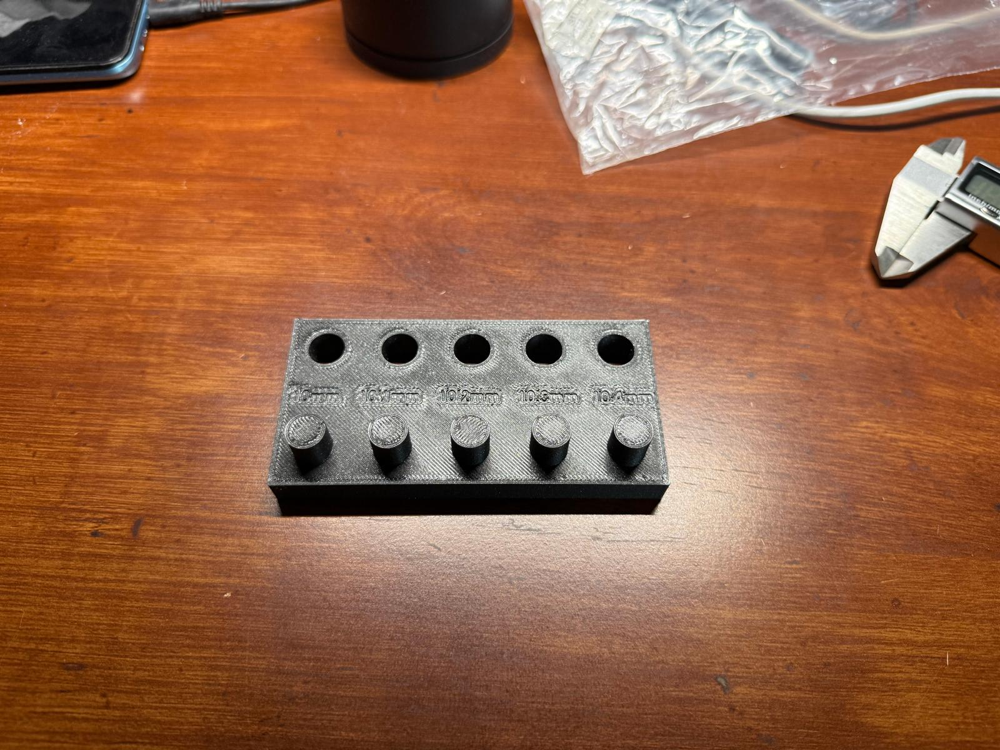

# Lab #4: Benchmark a Parameter — Tolerance Gauge Test

***

*Design*

### Parameter

I chose the **Tolerance Gauge Test** to benchmark the accuracy of the Prusa Core One. Since 3D printers typically have around a 3% tolerance limit, I predicted that all actual measurements would fall within 3% of the design dimensions.

To test both height and hole dimensions on a single part, I designed an artifact with 10 measurement points:
* **Height Measurement:** A 10mm base block with 5 circular beams extending upward at target heights of 10.0mm, 10.1mm, 10.2mm, 10.3mm, and 10.4mm (total nominal heights of 20.0mm to 20.4mm from the bottom surface).
* **Hole Measurement:** 5 extruded holes in the base with nominal diameters of 10.0mm, 10.1mm, 10.2mm, 10.3mm, and 10.4mm.

### Document Design

I chose my slicer settings in PrusaSlicer deliberately to balance dimensional stability and accuracy without exceeding machine time limits:
* **Perimeters:** 3 perimeter walls to give a strong outer shell and accurate side-wall dimensions.
* **Infill Percentage:** 15% standard infill, which gives sufficient structural support without adding unnecessary print time.
* **Infill Type:** Gyroid infill because it distributes load equally in all directions and prints smoothly.

**SolidWorks Design Steps:**

* **Step 1:** Sketched a 100mm * 50mm rectangle on the top plane and extruded it by 10mm to create the base.

  

* **Step 2:** Sketched a 10mm diameter circle on the top plane and extruded it by 10mm.

  

* **Step 3:** Sketched 4 more individual circles spaced 20mm apart from center to center and individually extruded them by 10.1mm, 10.2mm, 10.3mm, and 10.4mm.

  

* **Step 4:** Created reference construction lines 10mm from the top edge aligned with the circle centers. Sketched 5 circles with diameters of 10.0mm, 10.1mm, 10.2mm, 10.3mm, and 10.4mm, then cut-extruded them to create the holes.

  

* **Step 5:** Sketched a centerline and used the Text option to align dimension labels. Applied a 0.5mm Cut-Extrude to engrave the labels onto the model.

  

***

*Research*

### Preprocessor

The part was sliced using PrusaSlicer for PLA on the Prusa Core One:

* **Infill:** 15% Gyroid infill was selected to give uniform multi-directional strength while keeping the print time under the 1-hour limit.

  

* **Build Orientation & Supports:** The flat bottom face was seated directly on the build plate. This provided strong bed adhesion without requiring any print supports.

* **Perimeters:** 3 perimeter walls provided solid outer boundaries so measuring with digital calipers would not flex the part.

  

* **Slicing Preview:**

  

* **Slicer Adjustments:** The initial slicer settings estimated a print time slightly over 1 hour, so print speeds were increased slightly to stay within the machine time limit.

***

### Print Artifact

The test part was printed using PLA on the Prusa Core One.

* **Printed Artifact:**

  

* **Build Video:**

  <video src="Printing%20veideo.mp4" controls width="100%"></video>

#### Dimensional Measurement Points

Each feature was measured using digital calipers. Note that the average base height printed at 10.07mm, making total nominal beam heights 20.00mm, 20.10mm, 20.20mm, 20.30mm, and 20.40mm.

**Height Measurements:**
* Height 1 (20.00mm Nominal):

  

* Height 2 (20.10mm Nominal):

  

* Height 3 (20.20mm Nominal):

  

* Height 4 (20.30mm Nominal):

  

* Height 5 (20.40mm Nominal):

  

**Hole Measurements:**
* Hole 1 (10.00mm Nominal):

  

* Hole 2 (10.10mm Nominal):

  

* Hole 3 (10.20mm Nominal):

  

* Hole 4 (10.30mm Nominal):

  

* Hole 5 (10.40mm Nominal):

  

#### Comparison Chart

| Feature | Design Measurement (mm) | Actual Measurement (mm) | Difference (%) |
| :--- | :--- | :--- | :--- |
| **Height 1** | 20.00 | 19.94 | -0.30% |
| **Height 2** | 20.10 | 20.24 | +0.70% |
| **Height 3** | 20.20 | 20.31 | +0.54% |
| **Height 4** | 20.30 | 20.54 | +1.18% |
| **Height 5** | 20.40 | 20.47 | +0.34% |
| **Hole 1** | 10.00 | 9.81 | -1.90% |
| **Hole 2** | 10.10 | 9.91 | -1.88% |
| **Hole 3** | 10.20 | 10.02 | -1.76% |
| **Hole 4** | 10.30 | 10.14 | -1.55% |
| **Hole 5** | 10.40 | 10.28 | -1.15% |

*(Percentage Off calculated using standard formula: (Actual-Design)/Design *100 %)

***

### Lessons Learned

* **Outcome vs. Expectation:** My prediction was that all measurements would fall within 3% tolarance, which proved correct. All height errors stayed under +1.2% and all hole errors stayed under -1.9%. External heights consistently printed slightly oversized due to material thermal expansion, while internal holes printed undersized due to perimeter plastic contraction during cooling.
* **Class Design Rules Comparison:** The Prusa Core One matched and exceeded standard FDM expectations for external features ( 0.3% to 1.2% tolarance). However, internal holes fell short of exact CAD dimensions due to inner diameter shrinkage, requiring clearance compensation in slicer settings or CAD design.
* **Engineering Lessons Learned:**
  1. High-precision parts are not ideal for standard FDM printing because plastic shrinkage affects internal diameters significantly.
  2. FDM is best suited for rapid prototyping or non-critical parts that can handle reasonable loads without tight tolerances.
  3. When designing holes for FDM printing, add offset clearances in CAD (or enable X-Y hole compensation in PrusaSlicer) to achieve accurate fitments.
  4. Perimeter wall count affects external accuracy and strength far more than infill percentage.
* **Total Time Taken:** The total process took about 8 to 10 hours including brainstorming, studying requirements, CAD modeling, slicer setup, printing, measuring, and documentation.

***

### Resources

1. SolidWorks CAD Model: [Download SLDPRT](Tolerance%20gauge%20test.SLDPRT)
2. PrusaSlicer BGCODE File: [Download G-Code](Tolerance%20gauge%20and%20dymension%20calibration%20test_0.4n_0.2mm_PLA_COREONE_1h6m.bgcode)
3. Generative AI (Google Gemini) used to format report structure into GitHub Markdown.
4. Prusa Core One Manufacturer Datasheet & Class Design Rules PDF.
