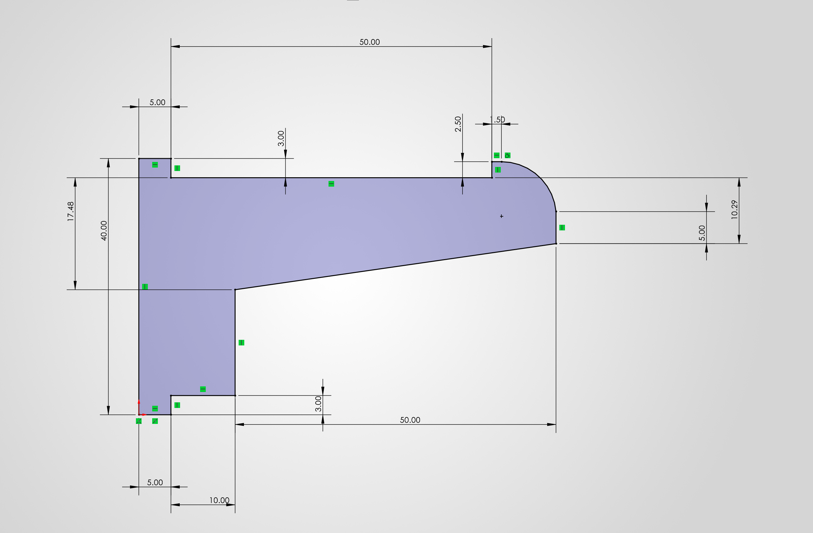
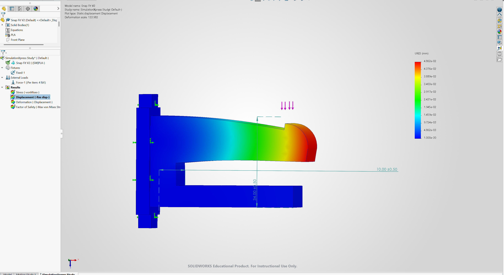
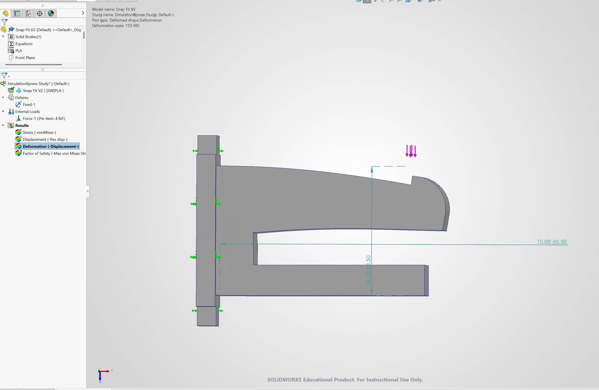
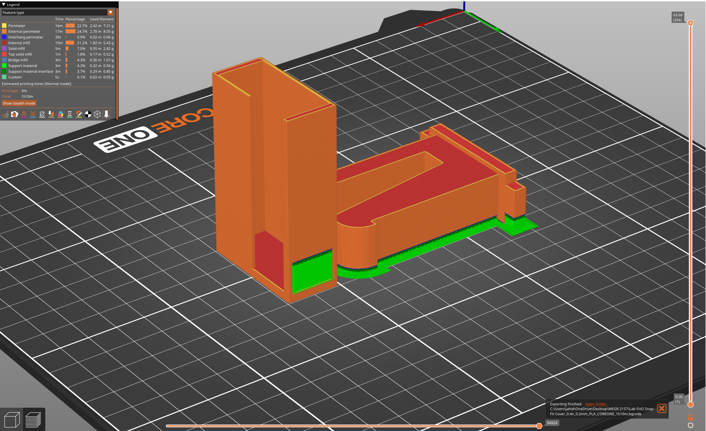

# Lab 5: Design a Snap Fit

**Total Time Spent:** 10 Hours

---

## Downloads

* [Download Assembly File (AssemV2.SLDASM)](AssemV2.SLDASM)
* [Download Snap Fit Part File (Snap Fit V2.SLDPRT)](Snap%20Fit%20V2.SLDPRT)
* [Download Snap Fit Cover Part File (Snap Fit Cover V2.SLDPRT)](Snap%20Fit%20Cover%20V2.SLDPRT)

---

## 1. Modeling Section

This section details the step-by-step CAD modeling process for both the Snap Clip and the Snap Clip Cover in SolidWorks.

### Snap Clip

#### Step 1: Base Sketch & Extrusion
Using the core dimension parameters, sketch the main flexure base profile on the Front Plane and extrude it by 15 mm.

#### Step 2: Wall Thickness Extrusion
Extrude both side walls by 1.5 mm so that the outer profile matches the wall thickness of the mating cover.

#### Step 3: Guide Extension Profile
Sketch an 8 x 15 mm profile on the mirrored side of the clip, then extrude by 45 mm to ensure a tight, guided fit when inserting the clip into the cover housing.

#### Step 4: Ergonomic Tab Extensions
On both the top and bottom surfaces of the base, extrude 5 mm grip features to allow for easy pushing and pulling during assembly and disassembly.

---

### Snap Clip Cover

#### Step 1: Cover Base
Sketch an 18.5 x 40 mm base profile and extrude it by 3 mm to form the rear structural endplate.

#### Step 2: Enclosure Walls
On the face of the base, sketch 2.9 mm top and bottom walls alongside 1.5 mm side walls, then extrude by 60.5 mm to create the primary sleeve profile.

#### Step 3: Retention Cutout
On the side wall where the snap clip flexure arm engages, cut out a pocket using the clip's retention dimensions as a direct reference.

---

## 2. Parametric Design & Mathematical Analysis

### Material Properties & Initial Parameters
* Material: 3D Printed PLA
* Young's Modulus (E) = 3.5 GPa = 3,500 MPa = 507,632 psi
* Yield Strength (sigma_y) = 60 MPa = 8,702 psi
* Factor of Safety (SF) = 3.5
* Allowable Stress (sigma_allow) = sigma_y / SF = 60 / 3.5 = 17.14 MPa (2,486 psi)

### Given Dimensions & Load Conditions
* Transverse Load (P) = 4 lbf = 17.79 N
* Axial Load (F_axial) = 7.5 lbf = 33.36 N
* Beam Length (l) = 50 mm = 1.9685 in
* Beam Width / Base (b) = 15 mm = 0.5905 in
* Max Deflection (Y) = 2.5 mm = 0.0984 in
* Root Height (h_0) = 17.48 mm = 0.6882 in
* Free End Height (h_l) = 8.74 mm = 0.3441 in (2:1 height taper ratio, h_l / h_0 = 0.5)

---

### Tapered Beam Mechanics & Deflection Calculations

For a rectangular cantilever beam with constant width b and linear height taper from h_0 at the fixed root to h_l at the free end, the deflection Y under a concentrated end load P is given by:

Y = (6 * P * (l^3)) / (E * b * (h_0^3)) * K_K

Where K_K is the taper correction coefficient. For a tapered beam decreasing linearly to h_l = 0.5 * h_0, K_K is approximately 1.5.

#### Second Moment of Area at Root (I_0)
I_0 = (b * (h_0^3)) / 12

I_0 = (15 * (17.48^3)) / 12 = (15 * 5339.44) / 12 = 6,674.3 mm^4

#### Deflection Check (Y)
Y = (1.5 * P * (l^3)) / (3 * E * I_0)

Y = (1.5 * 17.79 * (50^3)) / (3 * 3500 * 6674.3)
Y = (1.5 * 17.79 * 125000) / (70080150) = 333562.5 / 70080150 = 0.048 mm

Result: Since the actual structural root height of 17.48 mm provides high stiffness (Y = 0.048 mm, which is well below the 2.5 mm engagement limit), bending stresses remain well within safe limits.

---

### Stress Analysis & Verification

#### A. Bending Stress at Root (sigma_b)
The maximum bending moment M occurs at the fixed root:

M = P * l = 17.79 * 50 = 889.5 N*mm

Distance to Neutral Axis (c) = h_0 / 2 = 17.48 / 2 = 8.74 mm

sigma_b = (M * c) / I_0

sigma_b = (889.5 * 8.74) / 6674.3 = 7774.23 / 6674.3 = 1.165 MPa (169 psi)

Verification: sigma_b (1.165 MPa) < sigma_allow (17.14 MPa) --> PASS (Safe)

#### B. Axial Stress (sigma_axial)
During engagement or push-pull operation, the clip experiences an axial load of 33.36 N:

Cross-Sectional Area at Root (A_0) = b * h_0 = 15 * 17.48 = 262.2 mm^2

sigma_axial = F_axial / A_0

sigma_axial = 33.36 / 262.2 = 0.127 MPa (18.4 psi)

Verification: sigma_axial (0.127 MPa) << sigma_allow (17.14 MPa) --> PASS (Safe)

#### C. Average Shear Stress on Protrusion (tau_avg)
Assuming a snap lip height of 2.0 mm and an engagement depth (d_lip) of 3.0 mm:

Shear Area (A_s) = b * d_lip = 15 * 3.0 = 45 mm^2

tau_avg = P / A_s

tau_avg = 17.79 / 45 = 0.395 MPa (57.3 psi)

Allowable Shear Stress (tau_allow) = sigma_allow / 2 = 17.14 / 2 = 8.57 MPa

Verification: tau_avg (0.395 MPa) << tau_allow (8.57 MPa) --> PASS (Safe)

---

### Parametric Design Questions & Answers

1. **What are the parameters used?**
   * Beam length (l = 50.0 mm), beam root height (h_0 = 17.48 mm), free end height (h_l = 8.74 mm), beam width (b = 15.0 mm), deflection depth (Y = 2.5 mm), and wall clearances (1.5 mm side / 2.9 mm top-bottom).

2. **Why did you choose the specific parameters?**
   * Dimensions were chosen to achieve a minimum Factor of Safety of 3.5, ensuring bending stress (1.165 MPa) and axial stress (0.127 MPa) remain far below the allowable stress threshold (17.14 MPa) of 3D-printed PLA.

3. **What values did you choose for the specific parameters?**
   * l = 50.0 mm, h_0 = 17.48 mm, h_l = 8.74 mm, b = 15.0 mm, Y = 2.5 mm, cover wall thickness = 1.5 mm, engagement length = 45.0 mm, and handle extension = 5.0 mm.

4. **Did the values change throughout the process? If so, why?**
   * Yes, the root height was evaluated to ensure the tapered geometry maintained uniform stress distribution without exceeding allowable material strain under combined bending and push-pull axial loads.

5. **Take many pictures of the different stages of the CAD model.**
   *(Images documented above under Section 1: Modeling)*

6. **Detail the decision-making process and how you determined the engineered allowances of the interactive parts.**
   * A nominal clearance allowance of 0.2 mm to 0.3 mm was specified between sliding surfaces to account for FDM 3D printing dimensional tolerances and surface layer friction.

7. **Take a picture of the overall design in CAD.**

---

## 3. Finite Element Analysis (FEA) & Simulation

To validate the analytical cantilever calculations, Finite Element Analysis was conducted in SolidWorks Simulation using 3D-printed PLA material properties.

### Material Selection
PLA material properties were assigned to match the structural analysis setup.

### Von Mises Stress Analysis
The stress contour demonstrates maximum equivalent stresses located near the fixed root transition, confirming that values remain below the allowable yield limit.

.png)

### Displacement Analysis
Maximum displacement occurs at the cantilever tip during engagement, matching the nominal deflection target of 2.5 mm.

### Deformation Plot
The elastic deformation plot verifies uniform bending along the tapered beam profile without unpredicted stress concentration points.

### Factor of Safety Analysis
The structural simulation confirms a minimum Factor of Safety of 3.5, validating that the design will sustain repeated engagement cycles without yielding.

---

## 4. 3D Printing and Testing Section

### Research & Build Orientation Analysis
In FDM 3D printing, anisotropic layer bonding dictates that parts are weakest across layer boundaries (along the Z-axis). For a cantilever flexure beam subjected to bending loads, orienting the beam flat on the print bed (XY-plane orientation) ensures that tensile stresses align parallel to continuous extruded filament strands rather than pulling layers apart.

### Slicer Configuration & Infill Settings
* **Slicer Preview:** The part was sliced at a 0.20 mm layer height to achieve optimal dimensional tolerance and surface finish.

* **Infill Settings:** Configured with 20% infill density and reinforced perimeters to maximize structural rigidity at the flexure arm base.

### Process Video

*(Video demonstration of 3D printing the snap fit letters and functional testing will be placed here)*

*(Video demonstration of 3D printing the snap fit letters and functional testing will be placed here)*

## Resources

* [Prusa Research: Read about Supports](https://help.prusa3d.com/article/supports_1786)
* [Prusa YouTube: Organic Supports](https://www.youtube.com/watch?v=0k93N9Ea45E)
* [Prusa YouTube: Paint on Supports](https://www.youtube.com/watch?v=1d_e4aPBy7A)
* [Hubs: Snap Fit Joints: Types, Benefits, and Best Practices](https://www.hubs.com/knowledge-base/how-to-design-snap-fits/)
* [Formlabs: Snap Fits Guide: Design, Types, and Applications](https://formlabs.com/blog/snap-fit-joints/)
* [Designing of Plastic Products for Injection Moulding](https://www.bpf.co.uk/plastipedia/design/Designing_of_Plastic_Products_for_Injection_Moulding.aspx)
* UNCC Canvas Lab 5 Assignment Page & Lecture Slides: Snap Fit Assembly and Cantilever Beam Calculations
* Bambu Studio / PrusaSlicer Documentation: FDM Slicing, Layer Height Controls, and Infill Density Configuration
* Generative AI (Google Gemini) used to format report structure into GitHub Markdown.
