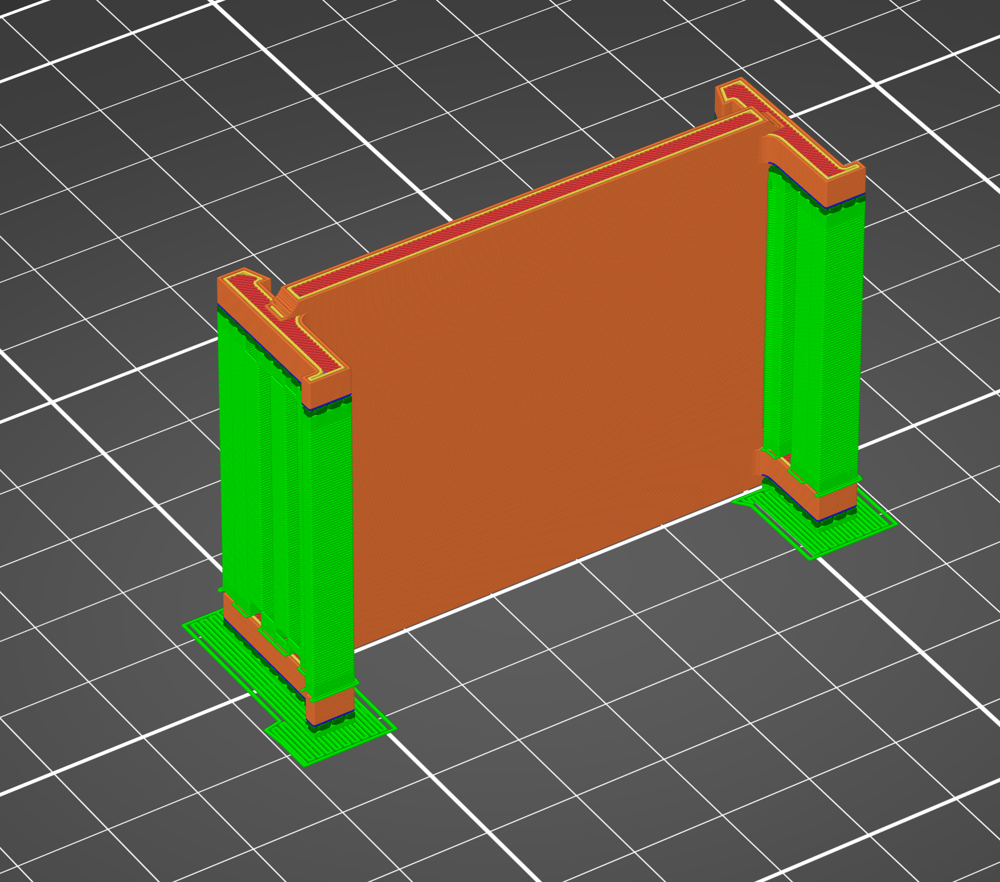

# Lab #6: Design Fits for an Artifact

## Parametrically design

### CAD Design Process & Step-by-Step Reconstruction

The design process involved taking precise physical measurements of the artifact's mating feature and parametrically modeling a custom clip component to achieve a secure snap fit.

* **Step 1:** Sketched a 1.75 x 2.11 in base rectangular feature and extruded it to a thickness of 0.125 in.

  

* **Step 2:** Sketched a pillar measuring 0.75 x 0.125 in on one side, located 0.25 in from the top edge of the base and 0.0625 in inward from the side edge. Extruded the pillar by 0.125 in and mirrored it to the opposite side along the same edge.

  

* **Step 3:** Using the same dimensions and offset distances from Step 2, sketched and mirrored two additional pillars on the opposite edge of the base.

  

* **Step 4:** Sketched a triangular catch profile on the inner-facing surface of one pillar. Mirrored the sketch across to the adjacent pillar and extruded the profile by 0.125 in. Repeated the process for the remaining two pillars to complete all four snap-fit engagement tabs.

  

* **Step 5:** Sketched 0.0625 x 0.125 in on the bottom of all four pillars and extruded them by 0.0625 in.

  

* **Step 6:** Applied fillet operations to the highlighted stress-concentration edges near the pillar roots and transition zones to improve bending durability during deflection.

  

---

### Parameters, Tolerances & Decision-Making

#### 1. Parameters Used

| Parameter | Artifact Dimension (in) | Snap Fit Drawing Dimension (in) |
| :--- | :--- | :--- |
| **Length (L)** | 2.7010 | 1.7500 |
| **Width (W)** | 2.1010 | 2.1100 |
| **Thickness (Min)** | 0.1125 (Target Area) | 0.1300 |
| **Thickness (Max)** | 0.1395 | N/A |

* **Width Tolerance:** Set to +- 0.005 in (Five Thousandths). If the width parameter is too large, the snap fit becomes too loose; if it is too small, the artifact cannot fit between the retaining pillars.
* **Length Parameter:** The snap clips grip along the sides, allowing the base component length (1.7500 in) to be shorter than the overall artifact length (2.7010 in) without sacrificing engagement strength.
* **Height / Thickness Allowance:** The maximum thickness (0.1395 in) occurs where the power input/output ports are located. Positioning the clips away from these ports avoids the maximum thickness region. The target feature minimum thickness is 0.1125 in, while the drawing specifies an opening gap of 0.1300 in with a -0.005 in tolerance, leaving sufficient clearance for insertion.
* *Note:* Prior testing in Lab #4 established our 3D printer height tolerance range as -0.3% to +1.18%.

#### 2. Reason for Parameter Selection
Parameters were selected based on critical functional interface dimensions of the physical artifact. By parameterizing the gap, width, and pillar offsets in CAD, tolerance adjustments could be pushed directly to the model without re-creating geometry features if test fits required tuning.

#### 3. Specific Parameter Values
* Base Width: 2.1100 in
* Base Length: 1.7500 in
* Internal Opening Gap Thickness: 0.1300 in
* Pillar Cross-Section: 0.7500 x 0.1250 in

#### 4. Parameter Changes Throughout Process

| Dimension | Snap Fit Drawing Dimension (in) | Snap Fit Actual Printed Dimension (in) |
| :--- | :--- | :--- |
| **Length (L)** | 1.7500 | 1.7520 |
| **Width (W)** | 2.1100 | 2.1130 |
| **Thickness** | 0.1300 | Min = 0.1290, Max = 0.1320 |

#### 5. Artifact Feature Measurements
Digital calipers were used to measure the physical artifact features, establishing a width of 2.1010 in and target region thickness of 0.1125 in.

#### 6. Hand Sketch & CAD Reference
A hand sketch was drafted to map datum references, critical tolerances, and clip profile dimensions.

#### 7. Artifact Feature Reconstruction
The mating features were recreated in CAD to verify geometric constraints and interference boundaries.

#### 8. CAD Model Development Stages
The model was built sequentially from initial base extrusions to clip geometry and edge fillets.

#### 9. Engineered Allowances & Decision Making
Allowances were determined by calculating the flexural deflection needed during insertion. A clip tip deflection allowance of 0.050 in (Fifty Thousandths) was engineered into the triangular lip face to allow outer arm expansion during snap-on engagement without exceeding material yield strength.

#### 10. Overall CAD Model Final View
Isometric view of the finalized parametric model.

---

## Documentation

### 3D Printing Parameters & Slicer Setup

1. **Machine Name:** Prusa CORE One (0.4 mm Nozzle, Printer #6)
2. **Print Size / Bounding Dimensions:** 1.7520 x 2.1130 x 0.2500 in (63.12 x 19.05 x 44.45 mm)
3. **Layout Reasoning:** The part was placed flat on the print bed to maximize bed adhesion area and promote uniform heat distribution across the base plate.
4. **Build Orientation:** Used right side of the parts as base to reduce the supports and also have stack up layer on clips. Bending stress has to cross a layer boundary over and over.
   
6. **Support Structure Size & Type:** Supports are needed for overhang beam (snap clips). Enabled smart detection for support surface area, and Snug support type.

   

7. **Wall Thickness:** 
   * Vertical: 0.86 mm
   * Horizontal Top: 5 layers (0.7 mm)
   * Horizontal Bottom: 3 layers (0.5 mm)

   

8. **Layer Count & Perimeters:** Wall perimeter is 2 layer loops used throughout the print.
9. **Layer Thickness / Height:** 0.86 mm perimeter width with 0.20 mm layer height.
10. **Build Volume Occupied:** 63.12 x 19.05 x 44.45 = 8425.05 mm^3 (0.514 in^3).

   

11. **Slicer Settings Rationale:**
    * **Perimeters:** 2 perimeter walls to give a strong outer shell and accurate side-wall dimensions.
    * **Infill Percentage:** 15% standard infill, which gives sufficient structural support without adding unnecessary print time.
    * **Infill Type:** Gyroid infill because it distributes load equally in all directions and prints smoothly.
12. **Support Removal Tools:** Used needle-nose pliers to remove the supports.
13. **Fit Adjustments & Failure Analysis:** Two critical points: if the dimension were incorrect or the tolerance isn't accurate, then the part would fail. Also, the deflection for clip is 0.05 in (Fifty Thousandths). If the clip broke because of deflection, then we need to reconsider the clip depth and feature width.

### Print Process Video
Below is the embedded video recording of the 3D printing process on the Prusa CORE One:

<video src="Printing Video.mp4" controls width="100%"></video>

---

## Show and Tell

The printed part was physically mated to the artifact feature to verify the snap-fit retention.

### Demonstration Video
Below is the embedded video demonstrating the snap fit onto the physical artifact:

<video src="Demonstration%20Video.mp4" controls width="100%"></video>

---

## Lessons Learned

* **FDM Anisotropy & Bending Stresses:** Layer line orientation is critical when designing snap-fit clips. Printing the arms such that bending stress acts across stacked layers prevents layer separation at the root of the cantilever beam.
* **Tolerance & Dimensional Accuracy:** Calibrating parameters based on known machine height variances (-0.3% to +1.18%) ensured that the actual printed thickness (0.1290 to 0.1320 in) matched our functional target gap (0.1300 in).
* **Support Placement for Mating Faces:** Using snug supports with smart surface detection reduced surface scarring on critical interior clip contact areas, allowing smooth deflection over the artifact edges.
* **Total Time & Resource Commitment:** 
  * **Actual Time:** About 8 Hours from start to finish (covering physical measurements, CAD parameter setup, test slicing, printing, support removal, and documentation).
  * **Material / Resources Used:** PLA Filament on Prusa CORE One (Printer #6), needle-nose pliers, digital calipers.

---

## Resources & Download Links

Below are the downloadable CAD model files, technical drawings, print-ready G-code, and 3MF project files for this assignment:

* [Download CAD Solid Part (.SLDPRT)](Snap%20fit.SLDPRT)
* [Download CAD Drawing File (.SLDDRW)](Snap%20fit.SLDDRW)
* [Download 3D Print Project (.3MF)](Snap%20fit.3mf)
* [Download Prusa CORE One BGCode File (.bgcode)](Snap%20fit_0.4n_0.2mm_PLA_COREONE_34m.bgcode)
